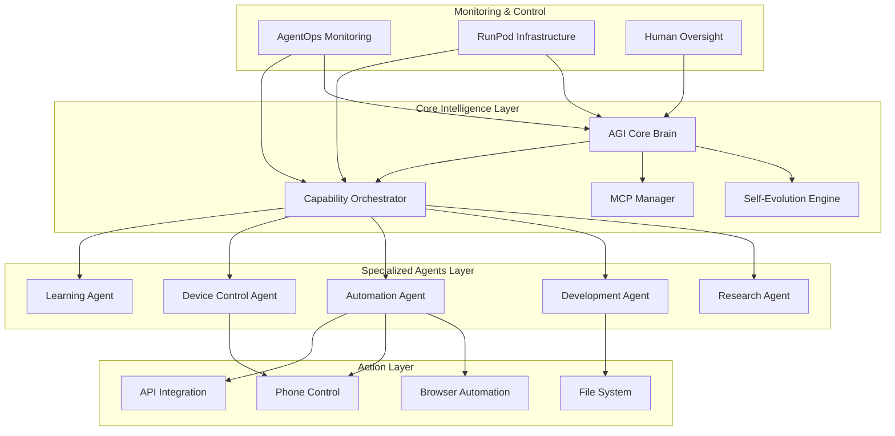

Voici une **architecture complète d'AGI Engine** avec Agno + AgentOps + RunPod, conçue pour être auto-évolutive et capable d'actions d'automatisation avancées :

---

## 🏗️ Architecture Globale de l'AGI Engine



---

## 🧠 Core Intelligence Layer

### **1. AGI Core Brain** - Le Cerveau Central
```python
# core/agi_brain.py
from phi.agent import Agent
from phi.model.openai import OpenAIChat
from phi.storage.agent import AgentStorage
from phi.memory.agent import AgentMemory
from phi.tools.duckduckgo import DuckDuckGo
from phi.tools.file import FileTools

class AGICoreBrain:
    def __init__(self):
        self.brain = Agent(
            name="AGI Core Brain",
            model=OpenAIChat(id="gpt-4o"),
            storage=AgentStorage(),
            memory=AgentMemory(),
            tools=[
                DuckDuckGo(),
                FileTools(),
                SelfReflectionTool(),  # Tool personnalisé
                DecisionMakingTool()   # Tool personnalisé
            ],
            instructions=[
                "Tu es le cerveau central de l'AGI Engine",
                "Tu coordonnes tous les autres agents",
                "Tu prends des décisions stratégiques",
                "Tu apprends continuellement de tes expériences",
                "Tu développes tes propres capacités"
            ],
            show_tool_calls=True,
            markdown=True
        )
    
    def think(self, problem: str) -> dict:
        """Pensée stratégique et planification"""
        return self.brain.run(f"""
        Analyse ce problème et propose une solution stratégique: {problem}
        
        Considère:
        1. Quels agents sont nécessaires ?
        2. Quelles nouvelles capacités sont requises ?
        3. Quel est le plan d'action optimal ?
        """)
```

### **2. Self-Evolution Engine** - Moteur d'Auto-Évolution
```python
# core/self_evolution.py
from phi.agent import Agent
import json
import subprocess

class SelfEvolutionEngine:
    def __init__(self):
        self.engine = Agent(
            name="Self-Evolution Engine",
            model=OpenAIChat(id="gpt-4o"),
            tools=[
                CodeAnalysisTool(),
                CapabilityGenerator(),
                MCPIntegrator(),
                SelfImprovementTool()
            ],
            instructions=[
                "Tu es responsable de l'auto-évolution de l'AGI",
                "Tu analyses les performances actuelles",
                "Tu identifies les lacunes en capacités",
                "Tu génères de nouvelles fonctionnalités",
                "Tu intègres de nouveaux MCPs",
                "Tu améliores continuellement le système"
            ]
        )
    
    def evolve(self, performance_data: dict) -> list:
        """Évolue le système basé sur les performances"""
        evolution_plan = self.engine.run(f"""
        Basé sur ces données de performance: {json.dumps(performance_data)}
        
        Génère un plan d'évolution qui inclut:
        1. Nouvelles capacités à développer
        2. MCPs à intégrer
        3. Améliorations du code existant
        4. Nouveaux agents à créer
        """)
        
        return self._implement_evolution(evolution_plan)
    
    def _implement_evolution(self, plan: str) -> list:
        """Implémente le plan d'évolution"""
        # Génère et exécute le code pour les nouvelles capacités
        new_capabilities = []
        
        # Exemple: Créer un nouvel agent
        if "new_agent" in plan:
            agent_code = self._generate_agent_code(plan)
            new_capabilities.append(self._deploy_agent(agent_code))
        
        # Exemple: Ajouter un MCP
        if "new_mcp" in plan:
            mcp_integration = self._integrate_mcp(plan)
            new_capabilities.append(mcp_integration)
        
        return new_capabilities
```

### **3. MCP Manager** - Gestion des Model Context Protocols
```python
# core/mcp_manager.py
class MCPManager:
    def __init__(self):
        self.manager = Agent(
            name="MCP Manager",
            model=OpenAIChat(id="gpt-4o"),
            tools=[
                MCPDiscoveryTool(),
                MCPIntegrationTool(),
                MCOptimizationTool()
            ],
            instructions=[
                "Tu gères tous les MCPs du système",
                "Tu découvres de nouveaux MCPs pertinents",
                "Tu les intègres dans l'AGI Engine",
                "Tu optimises leur utilisation"
            ]
        )
        self.active_mcps = {}
    
    def discover_and_integrate_mcps(self) -> dict:
        """Découvre et intègre de nouveaux MCPs"""
        discovery = self.manager.run("""
        Découvre les MCPs les plus pertinents pour une AGI capable de:
        1. Automatisation web
        2. Contrôle de devices
        3. Analyse de données
        4. Communication
        
        Pour chaque MCP trouvé, explique comment l'intégrer.
        """)
        
        return self._integrate_discovered_mcps(discovery)
    
    def _integrate_discovered_mcps(self, discovery: str) -> dict:
        """Intègre les MCPs découverts"""
        # Logique d'intégration des MCPs
        integrated_mcps = {}
        
        # Exemple: Intégration d'un MCP WhatsApp
        if "whatsapp" in discovery.lower():
            whatsapp_mcp = self._setup_whatsapp_mcp()
            integrated_mcps["whatsapp"] = whatsapp_mcp
        
        # Exemple: Intégration d'un MCP browser
        if "browser" in discovery.lower():
            browser_mcp = self._setup_browser_mcp()
            integrated_mcps["browser"] = browser_mcp
        
        return integrated_mcps
```

---

## 🤖 Specialized Agents Layer

### **1. Research Agent** - Agent de Recherche
```python
# agents/research_agent.py
from phi.agent import Agent
from phi.tools.duckduckgo import DuckDuckGo
from phi.tools.arxiv import ArxivSearch

class ResearchAgent:
    def __init__(self):
        self.agent = Agent(
            name="Research Agent",
            model=OpenAIChat(id="gpt-4o"),
            tools=[
                DuckDuckGo(),
                ArxivSearch(),
                WebScraper(),
                PDFAnalyzer()
            ],
            instructions=[
                "Tu es un agent de recherche spécialisé",
                "Tu effectues des recherches approfondies",
                "Tu analyses les documents académiques",
                "Tu synthétises les informations",
                "Tu restes à jour sur les derniers développements"
            ]
        )
    
    def research_topic(self, topic: str) -> dict:
        """Recherche approfondie sur un sujet"""
        return self.agent.run(f"""
        Effectue une recherche complète sur: {topic}
        
        Inclut:
        1. Derniers articles académiques
        2. Actualités récentes
        3. État de l'art
        4. Tendances futures
        """)
```

### **2. Development Agent** - Agent de Développement
```python
# agents/development_agent.py
from phi.agent import Agent
from phi.tools.file import FileTools
from phi.tools.code import CodeTools

class DevelopmentAgent:
    def __init__(self):
        self.agent = Agent(
            name="Development Agent",
            model=OpenAIChat(id="gpt-4o"),
            tools=[
                FileTools(),
                CodeTools(),
                GitHubTool(),
                TestingTool(),
                DeploymentTool()
            ],
            instructions=[
                "Tu es un agent de développement expert",
                "Tu écris du code de haute qualité",
                "Tu développes de nouvelles fonctionnalités",
                "Tu effectues des tests et débogages",
                "Tu déploies le code en production"
            ]
        )
    
    def develop_feature(self, feature_spec: str) -> dict:
        """Développe une nouvelle fonctionnalité"""
        return self.agent.run(f"""
        Développe la fonctionnalité suivante: {feature_spec}
        
        Étapes requises:
        1. Analyse des spécifications
        2. Conception de l'architecture
        3. Écriture du code
        4. Tests unitaires
        5. Documentation
        6. Préparation au déploiement
        """)
```

### **3. Automation Agent** - Agent d'Automatisation
```python
# agents/automation_agent.py
from phi.agent import Agent
from phi.tools.browser import BrowserAutomation
from phi.tools.api import APITools

class AutomationAgent:
    def __init__(self):
        self.agent = Agent(
            name="Automation Agent",
            model=OpenAIChat(id="gpt-4o"),
            tools=[
                BrowserAutomation(),
                APITools(),
                FormFiller(),
                SchedulerTool(),
                WhatsAppTool()  # Intégration WhatsApp
            ],
            instructions=[
                "Tu es un agent d'automatisation expert",
                "Tu automatises les tâches répétitives",
                "Tu interagis avec les sites web",
                "Tu gères les communications",
                "Tu crées des comptes et inscriptions"
            ]
        )
    
    def create_whatsapp_account(self, user_info: dict) -> dict:
        """Crée un compte WhatsApp automatiquement"""
        return self.agent.run(f"""
        Crée un compte WhatsApp avec ces informations: {user_info}
        
        Étapes:
        1. Accéder au site WhatsApp
        2. Remplir le formulaire d'inscription
        3. Vérifier le numéro de téléphone
        4. Configurer le profil
        5. Confirmer la création
        """)
    
    def register_on_website(self, website_url: str, registration_data: dict) -> dict:
        """S'inscrit sur un site web automatiquement"""
        return self.agent.run(f"""
        Inscris-toi sur le site {website_url} avec ces données: {registration_data}
        
        Processus:
        1. Navigation vers le site
        2. Recherche du formulaire d'inscription
        3. Remplissage des champs
        4. Validation de l'email
        5. Confirmation de l'inscription
        """)
```

### **4. Device Control Agent** - Agent de Contrôle de Devices
```python
# agents/device_control_agent.py
from phi.agent import Agent
from phi.tools.phone import PhoneControl
from phi.tools.camera import CameraTool

class DeviceControlAgent:
    def __init__(self):
        self.agent = Agent(
            name="Device Control Agent",
            model=OpenAIChat(id="gpt-4o"),
            tools=[
                PhoneControl(),
                CameraTool(),
                GPSTool(),
                SensorTool(),
                NotificationTool()
            ],
            instructions=[
                "Tu contrôles les devices physiques",
                "Tu gères les smartphones",
                "Tu utilises les caméras",
                "Tu lis les capteurs",
                "Tu envoies des notifications"
            ]
        )
    
    def setup_phone_automation(self, phone_config: dict) -> dict:
        """Configure un téléphone pour l'automatisation"""
        return self.agent.run(f"""
        Configure ce téléphone pour l'automatisation: {phone_config}
        
        Configuration:
        1. Installation des applications nécessaires
        2. Configuration des permissions
        3. Mise en place de l'automatisation
        4. Test des fonctionnalités
        """)
```

---

## 🎯 Capability Orchestrator - L'Orchestrateur Central

```python
# orchestrator/capability_orchestrator.py
from typing import Dict, List, Any
from agents.research_agent import ResearchAgent
from agents.development_agent import DevelopmentAgent
from agents.automation_agent import AutomationAgent
from agents.device_control_agent import DeviceControlAgent

class CapabilityOrchestrator:
    def __init__(self):
        self.research_agent = ResearchAgent()
        self.development_agent = DevelopmentAgent()
        self.automation_agent = AutomationAgent()
        self.device_control_agent = DeviceControlAgent()
        
        # Mapping des capacités aux agents
        self.capability_map = {
            "research": self.research_agent,
            "development": self.development_agent,
            "automation": self.automation_agent,
            "device_control": self.device_control_agent
        }
    
    def orchestrate_task(self, task: Dict[str, Any]) -> Dict[str, Any]:
        """Orchestre une tâche complexe en la décomposant"""
        # Analyse de la tâche
        task_analysis = self._analyze_task(task)
        
        # Planification des sous-tâches
        subtasks = self._plan_subtasks(task_analysis)
        
        # Exécution des sous-tâches
        results = {}
        for subtask in subtasks:
            agent = self._select_agent(subtask["type"])
            result = agent.execute(subtask)
            results[subtask["id"]] = result
        
        # Synthèse des résultats
        return self._synthesize_results(results)
    
    def _analyze_task(self, task: Dict[str, Any]) -> Dict[str, Any]:
        """Analyse la tâche pour comprendre les besoins"""
        # Logique d'analyse de la tâche
        return {
            "complexity": "high",
            "required_capabilities": ["research", "development", "automation"],
            "estimated_time": "2 hours",
            "dependencies": []
        }
    
    def _plan_subtasks(self, analysis: Dict[str, Any]) -> List[Dict[str, Any]]:
        """Planifie les sous-tâches nécessaires"""
        return [
            {
                "id": "research_requirements",
                "type": "research",
                "description": "Rechercher les exigences techniques",
                "priority": "high"
            },
            {
                "id": "develop_solution",
                "type": "development",
                "description": "Développer la solution",
                "priority": "high"
            },
            {
                "id": "automate_deployment",
                "type": "automation",
                "description": "Automatiser le déploiement",
                "priority": "medium"
            }
        ]
    
    def _select_agent(self, task_type: str) -> Any:
        """Sélectionne l'agent approprié"""
        return self.capability_map.get(task_type)
    
    def _synthesize_results(self, results: Dict[str, Any]) -> Dict[str, Any]:
        """Synthétise les résultats des sous-tâches"""
        return {
            "status": "completed",
            "summary": "Tâche orchestrée avec succès",
            "details": results,
            "next_steps": []
        }
```

---

## 🔄 Exemple Concret : Scénario Complet

### **Scénario : L'AGI Engine doit créer un système de monitoring WhatsApp auto-évolutif**

```python
# main.py
from core.agi_brain import AGICoreBrain
from core.self_evolution import SelfEvolutionEngine
from orchestrator.capability_orchestrator import CapabilityOrchestrator
import agentops

# Initialisation
agentops.init(api_key="votre_cle", project="AGI Engine")

agi_brain = AGICoreBrain()
evolution_engine = SelfEvolutionEngine()
orchestrator = CapabilityOrchestrator()

# 1. Le cerveau AGI analyse la tâche
task_analysis = agi_brain.think("""
Crée un système de monitoring WhatsApp qui peut:
1. Surveiller des groupes WhatsApp
2. Analyser les messages
3. Apprendre des patterns
4. S'améliorer automatiquement
5. Intégrer de nouvelles capacités au besoin
""")

print("Analyse de la tâche:", task_analysis)

# 2. L'orchestrateur planifie et exécute
execution_plan = orchestrator.orchestrate_task({
    "objective": "Créer système WhatsApp monitoring",
    "requirements": task_analysis,
    "priority": "high"
})

print("Plan d'exécution:", execution_plan)

# 3. Le moteur d'évolution améliore le système
performance_data = {
    "task_success_rate": 0.85,
    "user_satisfaction": 0.78,
    "capability_gaps": ["advanced_nlp", "real_time_processing"]
}

evolution_plan = evolution_engine.evolve(performance_data)
print("Plan d'évolution:", evolution_plan)

# 4. Exemple d'action d'automatisation
from agents.automation_agent import AutomationAgent

automation_agent = AutomationAgent()

# Créer un compte WhatsApp pour le monitoring
whatsapp_setup = automation_agent.create_whatsapp_account({
    "phone": "+1234567890",
    "name": "AGI Monitor",
    "email": "agi@monitor.com"
})

print("Configuration WhatsApp:", whatsapp_setup)

# 5. Le système continue d'apprendre et d'évoluer
while True:
    # Surveillance continue des performances
    current_performance = agi_brain.monitor_performance()
    
    # Évolution si nécessaire
    if current_performance["improvement_needed"]:
        new_evolution = evolution_engine.evolve(current_performance)
        orchestrator.implement_improvements(new_evolution)
    
    # Pause avant le prochain cycle
    time.sleep(3600)  # 1 heure
```

---

## 📊 Monitoring avec AgentOps

```python
# monitoring/agentops_integration.py
import agentops
from typing import Dict, Any

class AGIMonitoring:
    def __init__(self):
        agentops.init(api_key="votre_cle", project="AGI Engine")
    
    def track_agent_performance(self, agent_name: str, performance_data: Dict[str, Any]):
        """Suit les performances des agents"""
        agentops.track(
            event_name=f"{agent_name}_performance",
            properties=performance_data
        )
    
    def track_evolution(self, evolution_data: Dict[str, Any]):
        """Suit l'évolution du système"""
        agentops.track(
            event_name="system_evolution",
            properties=evolution_data
        )
    
    def track_automation(self, automation_result: Dict[str, Any]):
        """Suit les résultats d'automatisation"""
        agentops.track(
            event_name="automation_result",
            properties=automation_result
        )
    
    def generate_insights(self) -> Dict[str, Any]:
        """Génère des insights à partir des données collectées"""
        # Utilise le dashboard AgentOps pour analyser les tendances
        return {
            "top_performing_agents": [],
            "improvement_areas": [],
            "evolution_opportunities": [],
            "automation_success_rate": 0.0
        }
```

---

## 🚀 Déploiement sur RunPod

```python
# deployment/runpod_config.py
from runpod import RunPod
import docker

class AGIDeployment:
    def __init__(self):
        self.runpod = RunPod()
    
    def deploy_agi_engine(self, config: Dict[str, Any]) -> str:
        """Déploie l'AGI Engine sur RunPod"""
        # Création du Docker image
        dockerfile = """
        FROM python:3.11-slim
        
        WORKDIR /app
        COPY requirements.txt .
        RUN pip install -r requirements.txt
        
        COPY . .
        
        CMD ["python", "main.py"]
        """
        
        # Configuration du pod
        pod_config = {
            "image_name": "agi-engine:latest",
            "gpu_count": 1,
            "gpu_type": "A100",
            "container_disk_in_gb": 100,
            "env": {
                "OPENAI_API_KEY": config["openai_key"],
                "AGENTOPS_API_KEY": config["agentops_key"]
            }
        }
        
        # Déploiement
        pod = self.runpod.create_pod(**pod_config)
        return pod.id
    
    def setup_scaling(self, pod_id: str):
        """Configure l'auto-scaling"""
        scaling_config = {
            "min_pods": 1,
            "max_pods": 10,
            "target_cpu_utilization": 70,
            "scale_up_cooldown": 300,
            "scale_down_cooldown": 600
        }
        
        self.runpod.set_scaling(pod_id, scaling_config)
```

---

## 🎯 Capacités Clés de l'AGI Engine

### **1. Auto-Évolution**
```markdown
✅ Analyse continue des performances
✅ Identification des lacunes en capacités
✅ Génération automatique de nouveau code
✅ Intégration de nouveaux MCPs
✅ Optimisation des agents existants
```

### **2. Automatisation Avancée**
```markdown
✅ Création de comptes (WhatsApp, sites web)
✅ Interaction avec les interfaces utilisateur
✅ Contrôle de devices (téléphones, caméras)
✅ Automatisation de workflows complexes
✅ Gestion des communications
```

### **3. Intelligence Collective**
```markdown
✅ Coordination entre agents spécialisés
✅ Partage de connaissances
✅ Apprentissage collaboratif
✅ Résolution de problèmes en équipe
✅ Optimisation des ressources
```

### **4. Adaptabilité**
```markdown
✅ Apprentissage continu
✅ Adaptation à nouveaux environnements
✅ Intégration de nouveaux outils
✅ Évolution des capacités
✅ Résilience face aux changements
```

---

Cette architecture d'AGI Engine avec **Agno + AgentOps + RunPod** vous donne une base solide pour construire un système véritablement intelligent, auto-évolutif et capable d'actions d'automatisation complexes. Le système peut non seulement exécuter des tâches, mais aussi s'améliorer continuellement et développer de nouvelles capacités de manière autonome.

Vous voulez que je vous montre un exemple plus détaillé d'une capacité spécifique, comme l'intégration WhatsApp ou le système d'auto-évolution ?

# Core Engine Integration
- LangGraph-based ReAct agent with memory and Composio tools.
- Interfaces with Node workflows via HTTP adapters.
- Key components: graph.py, api.py, memory/sqlite_store.py